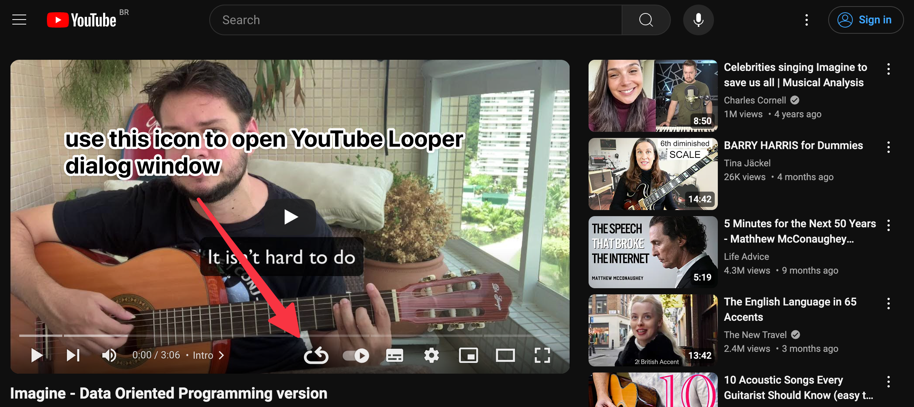

# YouTube Looper

This repository contains the source code for the YouTube looper extension.

## Install

You can install the extension from the [Chrome Web Store](https://chrome.google.com/webstore/detail/youtube-looper/bidjeabmcpopfddfcnpniceojmkklcje?hl=en-US&utm_source=chrome-ntp-launcher).

## Using the extension

The extension adds a new button into the YouTube player video toolbar:



When a video has chapters (like in this example), YouTube Looper will automatically create a loop on each chapter:


### Creating a loop

When you start a new loop, the current video time will be the start time of a loop. You can start a loop with the video
running or paused.

IMAGE

Once you mark the start point of the loop, you will see an indication of the time it started, and the `+` button gets
replaced with a stop button:

IMAGE

After click to stop, the new loop will be recorded and will be activated.

Naming your loops will really help you later to remember what that section is about. You can click on the loop label
to edit it:

IMAGE

The label is automatically saved as you type. Hit return or escape to remove the focus from label input.

### Tree View

When a loop time is contained inside the range of another loop, this loop will be displayed as a child of the parent
loop. This is common when you want, for example, to break a section to train in smaller sections and later go wider.
If there are many levels of nesting, the loops will indent accordingly.

IMAGE

### Duplicate loop

### Delete loop

### Cut loop

### Speed control

## Keyboard shortcuts

* `alt+z` - Start loop recording
* `alt+z` - End loop recording (after started)
* `alt+z` - Seek to begin of loop (when loop is active)
* `alt+shift+z` - Seek to begin of loop minus 3 seconds (when loop is active)

## Popup Window

WIP: Talk about features on popup window

## Dashboard

WIP: Talk about features in dashboard page

### Export / Import

### Import from the previous version

### Settings

## Running a sync server

This version of the YouTube Looper uses [TinyBase](https://tinybase.org/) as the data layer. 
If you have multiple devices or want to back up your data locally; you can run a server and connect to it!

You're going to need to have some developer tools installed on your machine:

- Bun
- Git

Download and run the server:

```
git clone https://github.com/wilkerlucio/youtube-looper-server.git
cd youtube-looper-server
bun run index.ts
```

After that, open the settings in the extension dashboard and paste this in the URL for the WebSocket connection:

```
ws://localhost:8047/youtube-looper
```

The background will turn green when the connection is successfully made.


### Status on modal

When you have sync turned on, you will notice a circle in the bottom area of the modal:

IMAGE

The green circle means the connection is working and your data is synced. If you see a red dot:

IMAGE

Go to the dashboard page and check your configuration.

### Backing up data

One way to back up the data from the server is to back up the files at `server-storage` folder.
There will be a JSON file called `youtube-looper.json` if you followed the configuration described above.

## Developing the extension

If you like to develop the extension, make sure you have `pnpm` installed, and them:

```
pnpm i
pnpm run dev
```

This will start the compilation and open the browser in an anonymous profile with the extension in dev mode installed
on it.
